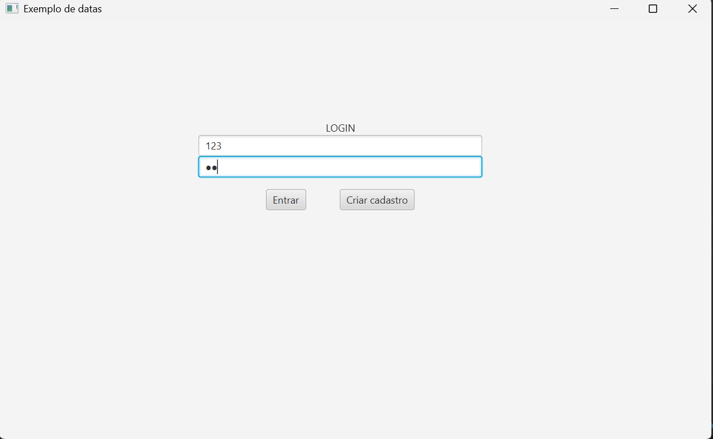
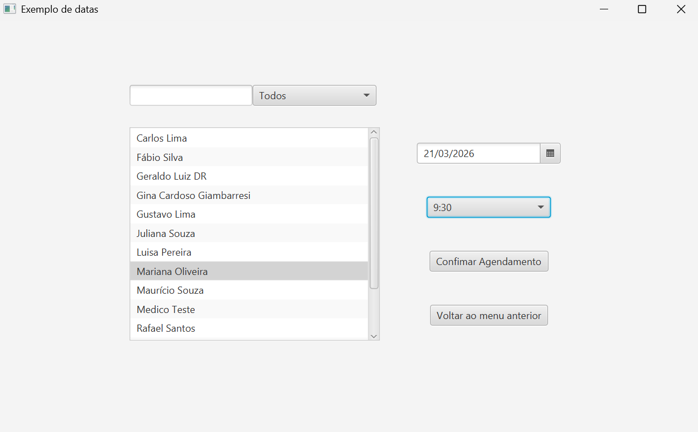
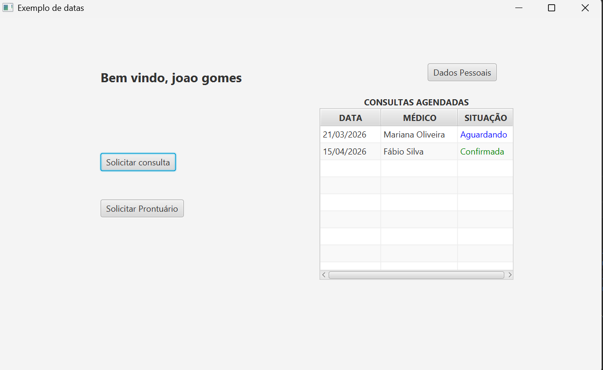
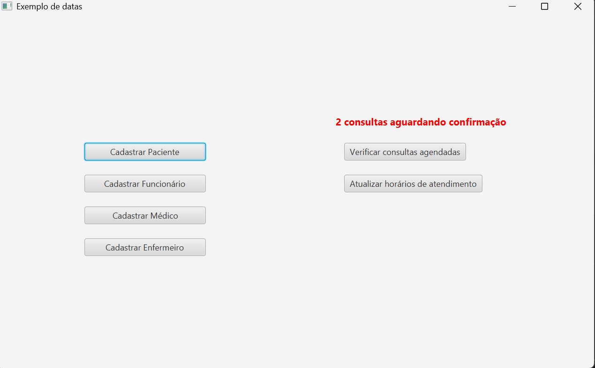
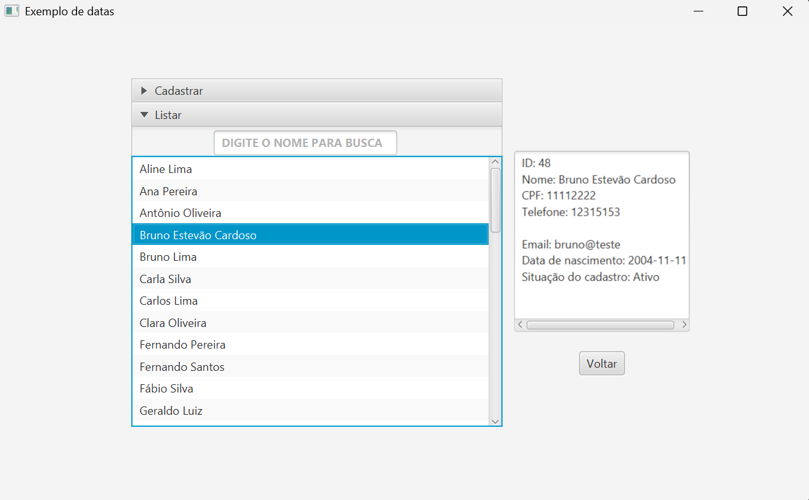
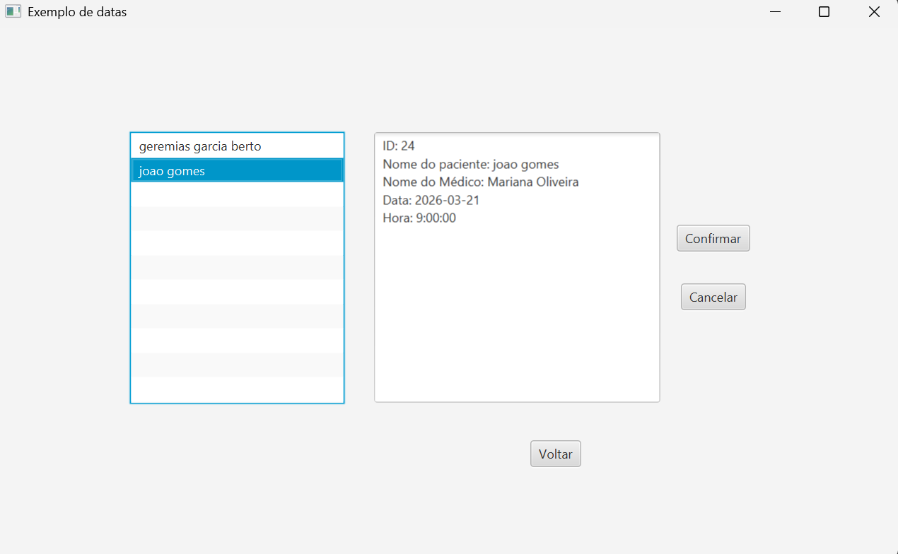
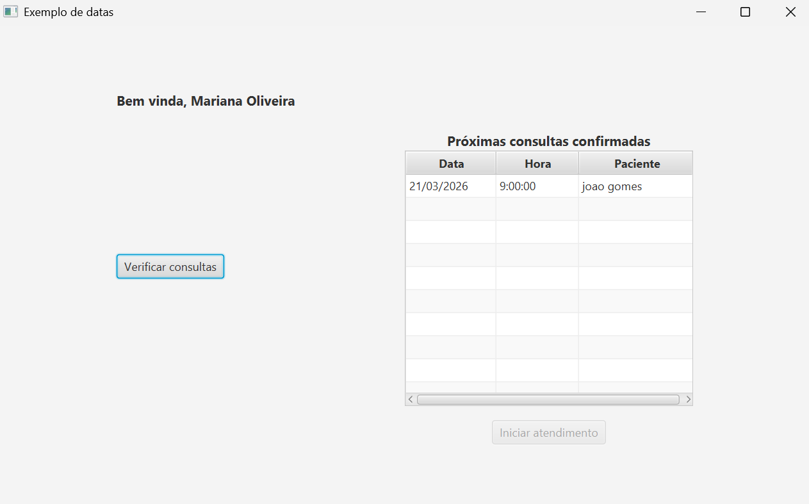
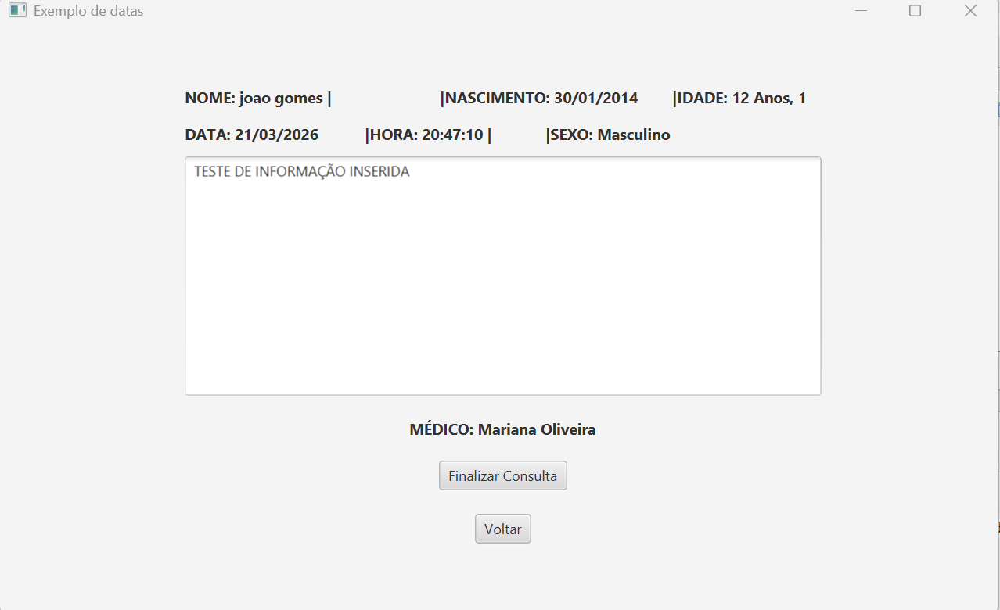
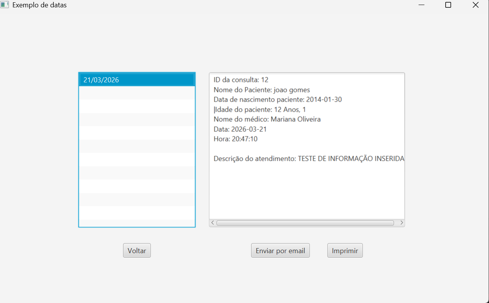

# 🏥 Sistema de Clínica

Aplicação desktop desenvolvida em **Java utilizando JavaFX** para gerenciamento de informações de uma clínica, com integração a banco de dados SQLite.

O sistema permite o cadastro, consulta e gerenciamento de informações, simulando um ambiente real de controle administrativo de uma clínica.

---

## 🚀 Tecnologias utilizadas

- Java  
- JavaFX  
- SQLite  
- JDBC  

---

## 📌 Funcionalidades

- Cadastro de pacientes  
- Gerenciamento de agendamentos  
- Controle de atendimentos médicos  
- Listagem e consulta de dados  
- Atualização e exclusão de registros  
- Integração com banco de dados SQLite  
- Interface gráfica com JavaFX  

---

## 🏗️ Arquitetura

O projeto é estruturado com separação entre:

- Interface gráfica (JavaFX)  
- Lógica de negócio  
- Acesso ao banco de dados (SQLite via JDBC)  

---

## 🧠 Objetivo do projeto

Este projeto foi desenvolvido com o objetivo de:

- Praticar desenvolvimento desktop com JavaFX  
- Trabalhar com persistência de dados utilizando SQLite  
- Aplicar conceitos de lógica de programação e organização de sistemas  
- Simular um sistema real de gestão de clínica  

---

## ▶️ Como executar

1. Clone o repositório:

```bash
git clone https://github.com/Geremias-Garcia/Projeto_clinica
```

2. Acesse a pasta do projeto:

```bash
cd Projeto_clinica
```
3. Execute a aplicação (pela IDE ou via terminal):

```bash
java -jar nome-do-arquivo.jar
```

(ou execute pela sua IDE, como IntelliJ ou Eclipse)

---

## 🚧 Status do projeto

Projeto acadêmico finalizado, com possibilidade de melhorias futuras e evolução de funcionalidades.

## 📷 Exemplos de telas

### 🔐 Tela de Login


---

### 📝 Solicitação de Consulta pelo Paciente


---

### 👤 Tela Inicial do Paciente


---

### 🧑‍💼 Painel do Funcionário


---

### 📋 Cadastro e Listagem de Pacientes


---

### ✅❌ Gerenciamento de Agendamentos (Aprovar/Rejeitar)


---

### 🩺 Painel do Médico


---

### 🏥 Tela de Atendimento


---

### 📄 Visualização de Prontuário pelo Paciente


---

## 👨‍💻 Autor

**Geremias Garcia Berto**  
📧 geremiasgarciaberto@gmail.com  
🔗 [LinkedIn](https://www.linkedin.com/in/geremias-garcia-berto/)
